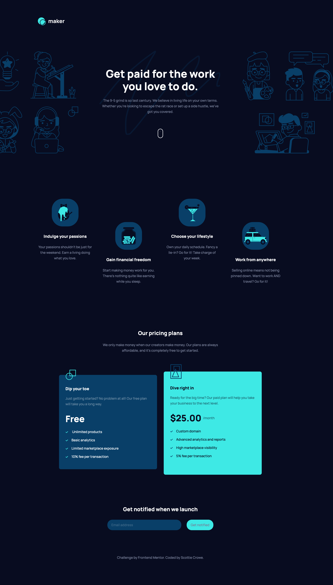

# Frontend Mentor - Maker pre-launch landing page solution

This is a solution to the [Maker pre-launch landing page challenge on Frontend Mentor](https://www.frontendmentor.io/challenges/maker-prelaunch-landing-page-WVZIJtKLd). Frontend Mentor challenges help you improve your coding skills by building realistic projects.

## Table of contents

- [Overview](#overview)
  - [The challenge](#the-challenge)
  - [Screenshot](#screenshot)
  - [Links](#links)
- [My process](#my-process)
  - [Built with](#built-with)
  - [What I learned](#what-i-learned)
  - [Continued development](#continued-development)
  - [Useful resources](#useful-resources)
- [Author](#author)

## Overview

### The challenge

Users should be able to:

- View the optimal layout depending on their device's screen size
- See hover states for interactive elements
- Receive an error message when the form is submitted if:
  - The `Email address` field is empty should show "Oops! Please add your email"
  - The email is not formatted correctly should show "Oops! That doesn’t look like an email address"

### Screenshot

### Links

- Solution URL: [maker-pre-launch solution](https://www.frontendmentor.io/solutions/maker-prelaunch-landing-page-sZ3RGFDp54)
- Live Site URL: [live site on Netlify](https://fm-maker-pre-launch-blckbird.netlify.app/)

## My process

### Built with

- HTML
- CSS custom properties
- Flexbox
- CSS Grid
- Netlify (for hosting)

### What I learned

Overall challenges:

- Learning to implement a mobile-first process. Althought this may be wrong, my approach was to create the mobile layout/styles first, then use media queiries (min-width) to transition between the various device-widths - specifically focusing on the smaller changes between different device-widths.

Some of the challenges I faced when building this website:

- Building the header section without directly placing images in the markup, but instead using the :psuedo before/after prefixes to display svg images to the right and left of the body content. This was especially challenge transitioning between different device widths. Although my solution works I will need to revise the markup and CSS. I later learned that the container holding the body content (the outer box) can be used to set those images heights rather than setting the heights of those images, as well as the body content container itself.
- The section outlining the benefits (directly under the header), at first, presented some challenges. After spending some time I was able to use flexbox to position elements in the staggering stance. I struggled to size the svg icons in their containers. I'm still not sure about how to approach this.
- The "our pricing" section presented it's own challenges, like, getting the cards to display at different heights. My approach for this was to set max-heights on the cards themselves.
- I'm still working through the email validation section, using JavaScript and RegEx to validate emails. The challenging part is how to get the error messaging/border to display when a user begins typing an incorrect email, including the the opposite (when a user begins typing a correct email, the border highlights green and no error message).

### Continued development

- I would like to focus my efforts on mastering layout using flexbox and CSS grid. Also, I struggle to truly understand positioning (relative, absolute) - for example, how top, bottom, right, and left work and where they inherit their width/heights from.

- Continue learning JavaScript and understanding the various APIs related to frontend web development.

- Continue progressing with Git - specifically work flow. I am able to use basically for my own projects. My goal is to understand pull request, how to structure projects (such as branching etc.).

### Useful resources

- [CSS-Tricks | Overriding Default Button Styles](https://css-tricks.com/overriding-default-button-styles/) - A great resources because...
- [CSS-Tricks | Small Tweaks That Can Make a Huge Impact on Your Website’s Accessibility](https://css-tricks.com/small-tweaks-can-make-huge-impact-websites-accessibility/#article-header-id-2) - This is an amazing article which helped me finally understand XYZ...
- [Codepen | HTML + pure CSS Vertical Toggle Switch](https://codepen.io/mgzme/pen/OqqeLM) - This codepen by Marco Gomez helped me understand how to make a verticle toggle switch
- [W3Schools | Animations](https://www.w3schools.com/css/css3_animations.asp) - This helped me understand how animations work

## Author

- Frontend Mentor - [@sdcrowe23](https://www.frontendmentor.io/profile/sdcrowe23)
